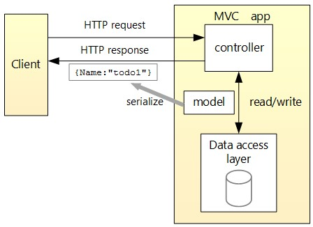

# TodoList-ASP.NetCoreWebApi-JavaScript
Todo List using the ASP.NET Core Web API and JavaScript. Controller-based web API that uses a database. 
 

ASP.NET Core Web API and JavaScript<a href="https://learn.microsoft.com/en-us/aspnet/core/tutorials/web-api-javascript?view=aspnetcore-8.0">link</a>
 

ASP.NET Core Web API Tutorial <a href="https://learn.microsoft.com/en-us/aspnet/core/tutorials/first-web-api?view=aspnetcore-8.0&tabs=visual-studio">link</a>
 

Design

 

Swagger Documentation  
<a href="https://learn.microsoft.com/en-us/aspnet/core/tutorials/web-api-help-pages-using-swagger?view=aspnetcore-8.0">link</a>
 

Notes:
<ul>
  <li>A model is a set of classes that represent the data that the app manages. The model for this app is the TodoItem class.</li>
  <li>The database context is the main class that coordinates Entity Framework functionality for a data model. In ASP.NET Core, services such as the DB context must be registered with the dependency injection (DI) container. The container provides the service to controllers.</li>
  <li>Add new Scaffolded Item in the Controllers folder to generate code.</li>
  <li>The return type of <code>ActionResult&lt;T></code> type. ASP.NET Core automatically serializes the object to JSON and writes the JSON into the body of the response message.</li>
</ul>

Prevent over-posting:
<ul>
  <li>Production apps typically limit the data that's input and returned using a subset of the model. </li>
  <li>There are multiple reasons behind this, and security is a major one.</li>
  <li>The subset of a model is usually referred to as a Data Transfer Object (DTO), input model, or view model.</li>
  <li>A DTO may be used to:
    <ul>
      <li>Prevent over-posting.</li>
      <li>Hide properties that clients are not supposed to view.</li>
      <li>Omit some properties in order to reduce payload size.</li>
      <li>Flatten object graphs that contain nested objects. Flattened object graphs can be more convenient for clients.</li>
    </ul>
  </li>
</ul>